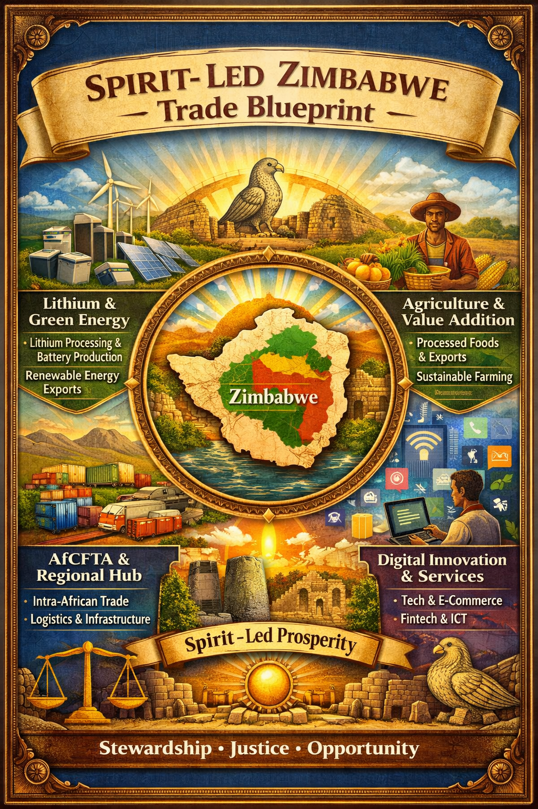

# Spirit-led Zimbabwe Trade Vision Blueprint

---

## 🌍 African Trading Systems and Zimbabwe’s Legacy

### 🏛️ Ancient African Trading Systems
- **Trans-Saharan Trade**: Connected West Africa with North Africa and the Mediterranean. Commodities: gold, salt, ivory, slaves. Cities: Timbuktu, Gao, Djenne. Camels revolutionized desert trade. Islam unified trade practices and introduced Arabic literacy.
- **Indian Ocean Trade**: Linked East African coast with Middle East, India, and Asia. Cities: Kilwa, Mombasa, Zanzibar. Goods: gold, ivory, slaves, spices, textiles. Created Swahili culture blending African, Arab, Persian, and Indian influences.
- **Southern African Trade**: Example: Great Zimbabwe (11th–15th century). Traded gold and cattle with Indian Ocean merchants. Archaeological finds: Chinese porcelain, Arab coins, glass beads.

### 🌟 Great Zimbabwe
- **How Great Was It?** Political capital controlling trade routes. Wealth from gold, cattle, ivory. Monumental stone architecture (Great Enclosure). Global connections proven by imported artifacts.
- **Why Was It Great?** Strategic location near gold mines. Trade links to Swahili coast and Asia. Cultural center of Shona traditions. Symbol of divine kingship and authority.
- **What Failed?** Resource strain (overgrazing, soil exhaustion). Shifting trade routes northwards. Political fragmentation and rival powers. Environmental pressures (droughts).
- **Legacy**: National symbol of Zimbabwe. UNESCO World Heritage Site. Proof of African ingenuity and sovereignty.

---

## ⚖️ Current Global Trading System
- **Rules-Based Framework**: WTO sets global trade rules. Regional blocs (EU, AfCFTA, USMCA) deepen integration.
- **Global Value Chains**: 70% of trade involves multi-country production. Example: smartphones assembled from parts across continents.
- **Honest Truths**: Power imbalance favors wealthy nations. Dependency on raw exports creates vulnerability. Invisible costs: labor exploitation, environmental harm. Geopolitics: sanctions and tariffs as trade weapons.
- **Current Shifts**: Critical minerals reshape priorities. Digital trade grows rapidly. Green trade pressures sustainability. Regionalization diversifies supply chains.

---

## 🌍 Africa’s Role in Global Trade
- **AfCFTA**: Largest free trade area by population. Boosts intra-African trade and bargaining power.
- **Mineral Wealth**: Rich in lithium, cobalt, platinum, rare earths. Central to green energy and tech industries.
- **Agriculture**: 60% of world’s uncultivated arable land. Exports coffee, cocoa, tea, fruits, grains.
- **Digital Trade**: Fintech and e-commerce reshape trade flows. Mobile banking enables cross-border commerce.

---

## ✨ Spirit-Led Roadmap for Zimbabwe’s Greatness

### Immediate Actions (1–3 Years)
- Lithium Refining
- Agricultural Revival
- AfCFTA Integration
- Governance Reset

### Medium-Term Actions (3–10 Years)
- Green Energy Hub
- Regional Manufacturing
- Digital Trade Expansion
- Cultural Tourism

### Long-Term Vision (10–30 Years)
- Global Trade Leadership
- Value-Added Economy
- Spirit-Led Identity

---

## 📜 Spirit-Led Zimbabwe Trade Declaration

### 🕊️ Opening Invocation
> “Let the stones of Great Zimbabwe speak again —
> not of ruins, but of restoration.
> Not of memory, but of movement.
> For the Spirit that built walls without mortar
> now builds systems without corruption.”

### 🌍 The Ancient Foundation
Africa’s trading legacy was never primitive — it was prophetic. From Timbuktu’s manuscripts to Kilwa’s ports, Africa was a continent of exchange, wisdom, and wealth. Great Zimbabwe stood as a beacon of governance, gold, and glory — a city where trade met faith.

### 🏛️ The Modern Mandate
Zimbabwe shall rise again, not by imitation, but by Spirit-led innovation. The Lithium fields shall power nations. The farmlands shall feed generations. The digital networks shall connect communities. The AfCFTA corridors shall unite Africa in commerce and covenant.

### ⚖️ The Pillars of Greatness
| Pillar      | Spirit-Led Meaning                | Modern Expression                  |
|-------------|-----------------------------------|------------------------------------|
| Stewardship | Managing resources with reverence | Ethical mining, sustainable farming|
| Justice     | Fair trade and governance         | Transparent policies, anti-corruption|
| Opportunity | Empowering every citizen          | Education, entrepreneurship, innovation|

### 🔥 The Prophetic Vision
> “From the ruins of stone shall rise a network of light.
> From the silence of history shall emerge a voice of trade.
> From the Spirit of truth shall flow the economy of righteousness.”

Zimbabwe’s greatness will be measured not in GDP alone, but in governance, unity, and purpose. It will be a nation where heritage fuels innovation, and faith governs prosperity.

### 🌅 Closing Declaration
> “We decree: Zimbabwe shall trade in truth,
> govern in justice,
> and prosper in Spirit.
> The walls of Great Zimbabwe shall stand again —
> not in stone, but in systems that endure.”

---

## 📌 Final Takeaway
Zimbabwe’s greatness today will be measured not by stone walls, but by walls of resilience in trade, governance, and innovation.

- Minerals → Technology
- Agriculture → Food Security
- Digital → Services Economy
- Heritage → National Pride

A Spirit-led Zimbabwe can rise again as a global trade powerhouse, connecting heritage to future, and purpose to prosperity.
